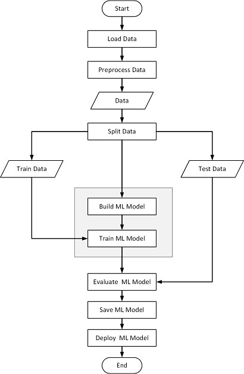

# Spray-Drying-Project

# Abstract

Food supply and consumption have contributed to climate change and environmental crisis, so a change in consumption habits is needed. Consumers are more particular in food products that provide additional health benefits, such as plant-based substitutes. Process optimization is essential for the food processing industry to increase yield while cutting down on industrial waste and cost. Dehydration is used to reduce moisture content in food products, and spray drying is a food preservation technique. Forecasting output parameters such as product yield and moisture content is needed to optimize spray drying processes.This study uses response surface and machine learning regression models (Decision Tree and Random Forest) to forecast the effect of input parameters on coconut and tiger nut milk (CTM) using spray drying technique. The experimental setup involved 20 instances of input parameters, including intake temperature, feed flowrate, and maltodextrin concentration. The study found that maltodextrin ratio and drying inlet air temperature significantly affect moisture content and yield. The ideal settings were 180°C inlet temperature, 10% maltodextrin concentration, and 4500 mL/L feed flowrate. The decision tree regression model provides an advantage in estimating process time and reducing operational costs.Finally, the decision tree regression model is deployed onto a web application to offer users a user an online platform to make calculations for spray drying output parameters given the input parameter values

# Methodology

The methodology used in this project invloved the following steps

1. Data collection
2. Preprocess data
3. Split data into training and testing parts
4. Build Machine Learning Model
5. Train ML model with training set
6. Test ML model with testing set
7. Analyze results
8. Deploy ML model onto web application
9. Deploy web application

The flowchat below shows the machine learning development process

